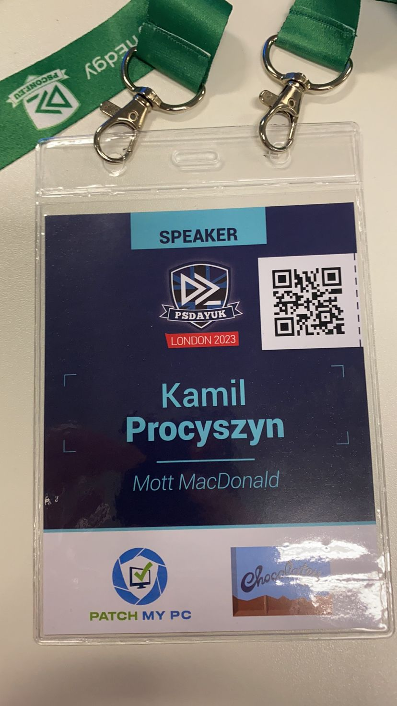



Side note, I was meant to publish this back in March 2023...

When I attended my first PowerShell meetup back in 2017, I had no idea it would lead me to where I am today.

Fast forward to 3rd of March 2023, I was privileged to speak and share my knowledge with other #PowerShell enthusiasts at #PsDayUk conference. I presented the PowerShell based web server and web framework, which enables anyone familiar with the language, to create web applications.

There were questions, there were raised hands, there was a conversation between me and other attendees - I hope everyone left with a wonderful experience.

Looking back and thinking that a few years ago I knew nothing about PowerShell, let alone writing code is just mind blowing.

I would like to thank everyone who came to my presentation, and everyone who has been with me on the journey.

It’s the support and encouragement of the community that keeps me motivated!

The journey is never ending. Journey before destination.

[Code and slides](https://github.com/thekamilpro/speaking/tree/main/PsDayUk2023)

